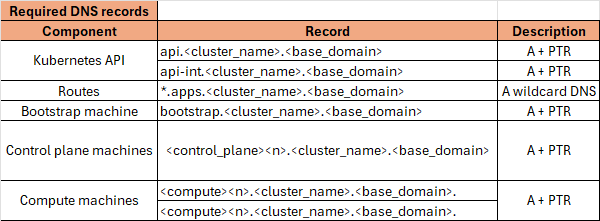

# OpenShift Installation — UPI (User-Provisioned Infrastructure)
## Disconnected (Air-gapped)

The **User-Provisioned Infrastructure (UPI)** method gives you **full control** over the infrastructure layer.  
Unlike **IPI (Installer-Provisioned Infrastructure)**, with UPI you must manually configure:

- Networking  
- Load balancing  
- DNS  
- DHCP  
- Storage  

---

## 🔹 UPI Workflow (High-level)
### 1. Network Details


### 2. Prepare Infrastructure
- Create a **Deployer (Bastion) VM** hosting:
  - **DNS server → `dnsmasq`**
  - **DHCP server → `dnsmasq`**
  - **Load balancer → `haproxy`**
  - **Private image registry → ``Red Hat Quay``**
- Provision VMs or physical hosts:
  - **Bootstrap**
  - **Control Plane (Masters)**
  - **Workers**
- Allocate IPs, MAC addresses, VLANs  
- Configure **DNS** (`api` + `*.apps` records)  
- Configure **Load Balancer** (HAProxy, F5, Nginx, etc.)  
- Configure **DHCP** (or assign static IPs)
- Download tools/CLIs


## 🔹 UPI Workflow (Low-level)
### 1. Deployer (Bastion) setup
- Install RHEL9 as os.
- Disable the FW and SElinux.
- hereunder all needed.
```bash 
   hostnamectl set-hostname bastion.openshifty.duckdns.org
   curl -LO https://mirror.openshift.com/pub/cgw/mirror-registry/latest/mirror-registry-amd64.tar.gz
   curl -LO https://mirror.openshift.com/pub/openshift-v4/x86_64/clients/ocp/latest/oc-mirror.rhel9.tar.gz
   curl -LO https://mirror.openshift.com/pub/openshift-v4/clients/butane/latest/butane-amd64
   curl -LO https://mirror.openshift.com/pub/openshift-v4/clients/ocp/4.18.21/openshift-client-linux.tar.gz
   curl -LO https://raw.githubusercontent.com/haithamkhalifa/OpenShift/refs/heads/master/examples/openshift.conf
   curl -LO https://raw.githubusercontent.com/haithamkhalifa/OpenShift/refs/heads/master/examples/haproxy.cfg
   wget https://github.com/mikefarah/yq/releases/latest/download/yq_linux_amd64 -O /usr/local/bin/yq
   
   chmod +x /usr/local/bin/yq
   sudo dnf install dnsmasq haproxy jq -y
   tar -xvzf oc-mirror.tar.gz
   sudo mv oc-mirror /usr/local/bin/
   mkdir ~/.docker/
   cat ~/pull-secret.txt | jq . > ~/.docker/config.json #get pull-secret from [Red Hat Console](https://console.redhat.com/openshift/downloads)
   ssh-keygen -t rsa -f /home/$USER/.ssh/id_rsa_quay -N '' -q
   ssh-keygen -t rsa -f /home/$USER/.ssh/id_rsa -N '' -q
   sduo cp openshift.conf /etc/dnsmasq.d/openshift.conf #DNS and DHCP Config
   sudo cp haproxy.cfg /etc/haproxy/haproxy.cfg # LB Config
   sudo systemctl enable --now dnsmasq
   sudo systemctl enable --now haproxy