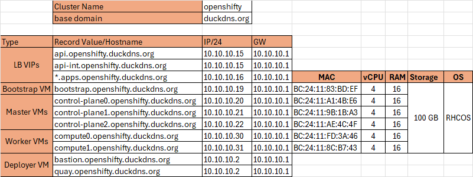

# OpenShift Installation — UPI (User-Provisioned Infrastructure)
## Disconnected (Air-gapped)

The **User-Provisioned Infrastructure (UPI)** method gives you **full control** over the infrastructure layer.  
Unlike **IPI (Installer-Provisioned Infrastructure)**, with UPI you must manually configure:

- Networking  
- Load balancing  
- DNS  
- DHCP  
- Storage  

---

## 🔹 UPI Workflow (High-level)
### 1. Network/DNS Details
- Allocate IPs, MAC addresses, VLANs,DNS.



### 2. Prepare Infrastructure
- Create a **Deployer (Bastion) VM** hosting:
  - **tools/CLIs**
  - **DNS server → `dnsmasq`**
  - **DHCP server → `dnsmasq`**
  - **Load balancer → `haproxy`**
  - **NTP server → `chrony`**
  - **Private image registry → ``Red Hat Quay``**
- Provision VMs or physical hosts:
  - **Bootstrap**
  - **Control Plane (Masters)**
  - **Workers**
- Configure **DNS** (`api` + `*.apps` records)  
- Configure **Load Balancer** (HAProxy, F5, Nginx, etc.)  
- Configure **DHCP** (or assign static IPs)


## 🔹 UPI Workflow (Low-level)
### 1. Deployer (Bastion) setup
- Install RHEL9 as os.
- System-wide Configs.
```bash
#Disable the FW and SElinux and configure hostname  
hostnamectl set-hostname bastion.openshifty.duckdns.org
sudo systemctl disable --now firewalld
sudo setenforce 0
sudo sed -i "s/^SELINUX=.*/SELINUX=disabled/" /etc/selinux/config'
```
- Download needed Tools/CLIs.
```bash 
mkdir ocp4-tools
cd ocp4-tools
# mirror-registery to be used as loca private image registry
curl -LO https://mirror.openshift.com/pub/cgw/mirror-registry/latest/mirror-registry-amd64.tar.gz
# oc-mirror client tool to mirror OCP images from Red Hat public registries to out local registry
curl -LO https://mirror.openshift.com/pub/openshift-v4/x86_64/clients/ocp/latest/oc-mirror.rhel9.tar.gz
# butane to convert yaml (configurations) to machineconfig
curl -LO https://mirror.openshift.com/pub/openshift-v4/clients/butane/latest/butane-amd64
# oc openshift client to interact with cluster, best to download oc for the same version of ocp 
# it contains oc, kubectl and helm 
curl -LO https://mirror.openshift.com/pub/openshift-v4/clients/ocp/4.18.21/openshift-client-linux.tar.gz
# dnsmasq configuration, DHCP and DNS
curl -LO https://raw.githubusercontent.com/haithamkhalifa/OpenShift/refs/heads/master/examples/openshift.conf
curl -LO https://raw.githubusercontent.com/haithamkhalifa/OpenShift/refs/heads/master/examples/dnsmasq-systemd-override.conf
# HAproxy LoadBalancer configuration
curl -LO https://raw.githubusercontent.com/haithamkhalifa/OpenShift/refs/heads/master/examples/haproxy.cfg
curl -LO https://raw.githubusercontent.com/haithamkhalifa/OpenShift/refs/heads/master/examples/haproxy-systemd-override.conf
# yq to parse and validate yaml files
wget https://github.com/mikefarah/yq/releases/latest/download/yq_linux_amd64
```
- Installing/Configuring Tools/CLIs.
```bash 
cd ocp4-tools
sudo dnf install dnsmasq haproxy jq chrony -y
sudo cp yq_linux_amd64 /usr/local/bin/yq
sudo chmod +x /usr/local/bin/yq
tar -xvzf oc-mirror.tar.gz
sudo mv oc-mirror /usr/local/bin/
sduo cp openshift.conf /etc/dnsmasq.d/openshift.conf
sudo cp haproxy.cfg /etc/haproxy/haproxy.cfg
mkdir /etc/systemd/system/dnsmasq.service.d/ /etc/systemd/system/haproxy.service.d/
sudo cp dnsmasq-systemd-override.conf /etc/systemd/system/dnsmasq.service.d/override.conf
sudo cp haproxy-systemd-override.conf /etc/systemd/system/haproxy.service.d/override.conf 
sudo systemctl enable --now dnsmasq
sudo systemctl enable --now haproxy
```
### 2. Cluster setup

##### 2.1 Mirror OpenShift Release Images to disk in Connected Environment 
```bash
mkdir ~/.docker/
#get pull-secret from [Red Hat Console](https://console.redhat.com/openshift/downloads)
cat ~/pull-secret.txt | jq . > ~/.docker/config.json

# 1. Mirror to disk: export the image set into an archive
nohup oc mirror -c ./ImageSetConfiguration.yaml file://./ --v2 > oc-mirror-to-disk.out &
# 2. Transfer the archive to the disconnected network manually
```


##### 2.2 Install Mirror Registry
```bash
# ssh key to be used for quay
ssh-keygen -t rsa -f /home/$USER/.ssh/id_rsa_quay -N '' -q
mkdir -p /registry/{quayRoot,quayStorage,sqliteStorage}
mkdir -p /registry/quayRoot/quay-config/
#generate a cert ssl or use let's encrypt check https://github.com/haithamkhalifa/OpenShift/blob/master/docs/get-free-domain-with-valid-cert.md
cp openshifty.duckdns.org.crt openshifty.duckdns.org.key fullchain.crt /registry/quayRoot/quay-config/
ssh-copy-id devops@quay.openshifty.duckdns.org
### INSTALL Quay ###	
./mirror-registry install \
--quayHostname quay.openshifty.duckdns.org \
--quayRoot /registry/quayRoot \
--initPassword P@ssw0rd \
--initUser devops \
--quayStorage /registry/quayStorage \
--sqliteStorage /registry/sqliteStorage \
--ssh-key /home/devops/.ssh/id_rsa_quay \
--sslCert /registry/quayRoot/quay-config/fullchain.crt \
--sslKey /registry/quayRoot/quay-config/openshifty.duckdns.org.key \
--targetHostname quay.openshifty.duckdns.org \
--targetUsername devops \
--verbose

# add ~/.docker/config.json result of echo -n 'devops:P@ssw0rd' | base64 -w0 with quay.openshifty.duckdns.org:8443 
mkdir ~/.docker/
echo '{"auths":{"quay.openshifty.duckdns.org:8443":{"auth":"ZGV2b3BzOlBAc3N3MHJk"}}}' > ~/.docker/config.json
podman login -u devops -p P@ssw0rd quay.openshifty.duckdns.org:8443 
```


##### 2.3 Mirror OpenShift Release Images from disk to the loca private registery
```bash
# 3. Disk to mirror: import the archive into your disconnected registry
nohup oc mirror -c ./ImageSetConfiguration.yaml --from file://./ docker://quay.openshifty.duckdns.org:8443 --v2 > oc-disk-to-mirror.out & 

#generated content will be used in install-config.yaml file and in extraction of openshift-install
```

##### 2.4 Extract openshift-install from mirrored content
```bash
export LOCAL_SECRET_JSON=~/.docker/config.json
export LOCAL_REGISTRY=quay.openshifty.duckdns.org:8443
export LOCAL_REPOSITORY=openshift/release-images
export OCP_RELEASE=4.18.1
export IDMS=/registry/oc-mirror/working-dir/cluster-resources/idms-oc-mirror.yaml
export ARCHITECTURE=x86_64

oc adm release extract -a ${LOCAL_SECRET_JSON} \
  --idms-file=${IDMS} \
  --command=openshift-install \
  ${LOCAL_REGISTRY}/${LOCAL_REPOSITORY}:${OCP_RELEASE}-${ARCHITECTURE}
```

##### 2.5 Create `install-config.yaml`
```yaml
apiVersion: v1
baseDomain: duckdns.org
compute: 
- hyperthreading: Enabled 
  name: worker
  replicas: 0 
controlPlane: 
  hyperthreading: Enabled 
  name: master
  replicas: 3 
metadata:
  name: openshifty
networking:
  clusterNetwork:
  - cidr: 10.128.0.0/14 
    hostPrefix: 23 
  networkType: OVNKubernetes 
  serviceNetwork: 
  - 172.30.0.0/16
platform:
  none: {} 
fips: false 
pullSecret: 'PULL_SECRET'
sshKey: 'SSH_KEY'
imageDigestSources:
- mirrors:
  - quay.openshifty.duckdns.org:8443/devops/ocp4/openshift/release
  source: quay.io/openshift-release-dev/ocp-v4.0-art-dev
- mirrors:
  - quay.openshifty.duckdns.org:8443/devops/ocp4/openshift/release-images
  source: quay.io/openshift-release-dev/ocp-release
```

##### 2.6 geneate manifests and customize it
```bash
openshift-install create manifests --dir=ocp4-install --log-level=debug
sed -i 's/mastersSchedulable: true/mastersSchedulable: false/g' ocp4-install/manifests/cluster-scheduler-02-config.yml
cat ocp4-install/manifests/image-digest-mirror-set.yaml

#dowload https://raw.githubusercontent.com/haithamkhalifa/OpenShift/refs/heads/master/examples/99-worker-chrony.bu and edit the ntp server ip/dns
butane 99-worker-chrony.bu -o 99-worker-chrony.yaml
cp 99-worker-chrony.yaml 99-master-chrony.yaml
sed -i 's/worker/master/g' 99-master-chrony.yaml
cp 99-master-chrony.yaml 99-worker-chrony.yaml ocp4-install/manifests/

```

##### 2.7 geneate ignition-configs
```bash
openshift-install create ignition-configs --dir=ocp4-install --log-level=debug
```

##### 2.8 Provision bootstrap + masters + workers
- Make VM template with rhcos iso attached, allocate CPU, MEMORY and DISK, assure you enabled the hotplug/NUMA 
- clone the template into cluster VMs and edit the MAC address
- bootstrap node
 - change MAC
 - start VM
 - sudo coreos-installer install --insecure-ignition --copy-network --ignition-url=http://10.10.10.2:8081/bootstrap.ign /dev/vda
 - snapshot
 - ssh and watch 
- Start master nodes
 - change MAC
 - start VM
 - sudo coreos-installer install --insecure-ignition --copy-network --ignition-url=http://10.10.10.2:8081/master.ign /dev/vda
 - snapshot
 - ssh and watch 
- Start Workers
 - change MAC
 - start VM
 - sudo coreos-installer install --insecure-ignition --copy-network --ignition-url=http://10.10.10.2:8081/worker.ign /dev/vda
 - snapshot
 - ssh and watch 

##### 2.9 Wait for bootstrap complete
```bash
openshift-install wait-for bootstrap-complete --dir=ocp4-install --log-level=debug
```

##### 2.10 Join worker nodes
```bash
oc get csr
oc adm certificate approve <csr-name>
```

##### 2.11 Verify cluster
```bash
oc get nodes
oc get co
```

