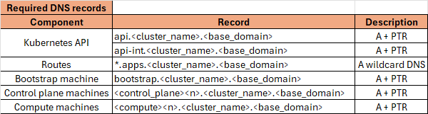

# OpenShift Installation — UPI (User-Provisioned Infrastructure)
## Disconnected (Air-gapped)

The **User-Provisioned Infrastructure (UPI)** method gives you **full control** over the infrastructure layer.  
Unlike **IPI (Installer-Provisioned Infrastructure)**, with UPI you must manually configure:

- Networking  
- Load balancing  
- DNS  
- DHCP  
- Storage  

---

## 🔹 UPI Workflow (High-level)
### 1. Network/DNS Details


### 2. Prepare Infrastructure
- Create a **Deployer (Bastion) VM** hosting:
  - **tools/CLIs**
  - **DNS server → `dnsmasq`**
  - **DHCP server → `dnsmasq`**
  - **Load balancer → `haproxy`**
  - **NTP server → `chrony`**
  - **Private image registry → ``Red Hat Quay``**
- Provision VMs or physical hosts:
  - **Bootstrap**
  - **Control Plane (Masters)**
  - **Workers**
- Allocate IPs, MAC addresses, VLANs  
- Configure **DNS** (`api` + `*.apps` records)  
- Configure **Load Balancer** (HAProxy, F5, Nginx, etc.)  
- Configure **DHCP** (or assign static IPs)


## 🔹 UPI Workflow (Low-level)
### 1. Deployer (Bastion) setup
- Install RHEL9 as os.
- System-wide Configs.
```bash
   #Disable the FW and SElinux and configure hostname  
   hostnamectl set-hostname bastion.openshifty.duckdns.org
   sudo systemctl disable --now firewalld
   sudo setenforce 0
   sudo sed -i "s/^SELINUX=.*/SELINUX=disabled/" /etc/selinux/config'
```
- Download needed Tools/CLIs.
```bash 
  mkdir ocp4-tools
  cd ocp4-tools
  # mirror-registery to be used as loca private image registry
  curl -LO https://mirror.openshift.com/pub/cgw/mirror-registry/latest/mirror-registry-amd64.tar.gz
  # oc-mirror client tool to mirror OCP images from Red Hat public registries to out local registry
  curl -LO https://mirror.openshift.com/pub/openshift-v4/x86_64/clients/ocp/latest/oc-mirror.rhel9.tar.gz
  # butane to convert yaml (configurations) to machineconfig
  curl -LO https://mirror.openshift.com/pub/openshift-v4/clients/butane/latest/butane-amd64
  # oc openshift client to interact with cluster, best to download oc for the same version of ocp 
  # it contains oc, kubectl and helm 
  curl -LO https://mirror.openshift.com/pub/openshift-v4/clients/ocp/4.18.21/openshift-client-linux.tar.gz
  # dnsmasq configuration, DHCP and DNS
  curl -LO https://raw.githubusercontent.com/haithamkhalifa/OpenShift/refs/heads/master/examples/openshift.conf
  # HAproxy LoadBalancer configuration
  curl -LO https://raw.githubusercontent.com/haithamkhalifa/OpenShift/refs/heads/master/examples/haproxy.cfg
  # yq to parse and validate yaml files
  wget https://github.com/mikefarah/yq/releases/latest/download/yq_linux_amd64
```
- Installing/Configuring Tools/CLIs.
```bash 
  cd ocp4-tools
  sudo dnf install dnsmasq haproxy jq chrony -y
  cp yq_linux_amd64 /usr/local/bin/yq
  sudo chmod +x /usr/local/bin/yq
  tar -xvzf oc-mirror.tar.gz
  sudo mv oc-mirror /usr/local/bin/
  sduo cp openshift.conf /etc/dnsmasq.d/openshift.conf
  sudo cp haproxy.cfg /etc/haproxy/haproxy.cfg
  sudo systemctl enable --now dnsmasq
  sudo systemctl enable --now haproxy
```
### 2. Cluster setup
- Install Mirror Registry and Mirror OCP v4.18.x Images.
```bash
   mkdir ~/.docker/
   #get pull-secret from [Red Hat Console](https://console.redhat.com/openshift/downloads)
   cat ~/pull-secret.txt | jq . > ~/.docker/config.json
   # ssh key to be used for quay
   ssh-keygen -t rsa -f /home/$USER/.ssh/id_rsa_quay -N '' -q
   mkdir -p /registry/{quayRoot,quayStorage,sqliteStorage}
   mkdir -p /registry/quayRoot/quay-config/
   #generate a cert ssl or use let's encrypt
   cp openshifty.duckdns.org.crt openshifty.duckdns.org.key fullchain.crt /registry/quayRoot/quay-config/
   ssh-copy-id devops@quay.openshifty.duckdns.org
      ### INSTALL Quay ###	
      ./mirror-registry install \
        --quayHostname quay.openshifty.duckdns.org \
        --quayRoot /registry/quayRoot \
        --initPassword P@ssw0rd \
        --initUser devops \
        --quayStorage /registry/quayStorage \
        --sqliteStorage /registry/sqliteStorage \
        --ssh-key /home/devops/.ssh/id_rsa_quay \
        --sslCert /registry/quayRoot/quay-config/fullchain.crt \
        --sslKey /registry/quayRoot/quay-config/openshifty.duckdns.org.key \
        --targetHostname quay.openshifty.duckdns.org \
        --targetUsername devops \
        --verbose


```